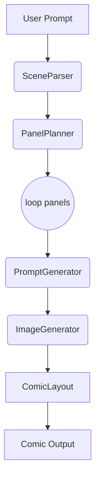

# 🎨 Prompt-to-Comic

**Prompt-to-Comic** is an AI-powered app that turns a creative scene or idea into a visual comic strip. Built with LangGraph, GPT-4o, FastAPI, and DALL·E/SDXL, the system parses your prompt, breaks it into panels, generates art for each scene, and assembles it into a polished, downloadable comic.

---

## 📸 Demo
  
👉 Try it locally with a prompt like:

> "Two kids in a spaceship arguing about pineapple pizza while a robot watches."

---

## 🧠 How It Works

| Stage | What Happens |
|-------|---------------|
| 🧾 Scene Parsing | Break down prompt into characters, setting, actions |
| 🎞️ Panel Planning | Split the scene into 2–6 visual panels |
| 🖋️ Prompt Generation | Turn each panel into a DALL·E/SDXL prompt |
| 🧠 AI Image Gen | Generate images via API |
| 🖼️ Comic Layout | Arrange into a comic strip and export to PNG/PDF |

Built using **LangGraph**, each stage is a reusable, testable node in a directed graph.

---

## ⚙️ Tech Stack

| Layer        | Tech                                |
|--------------|-------------------------------------|
| Backend      | **FastAPI**, LangGraph, OpenAI API |
| Frontend     | **Streamlit**                       |
| Image Models | DALL·E 3 / Replicate SDXL           |
| Layout       | Pillow, ReportLab (PDFs)            |
| Infra        | Docker, .env, HTTPX                 |

---

## 🚀 Quickstart

### Prerequisites
- Python 3.11+
- OpenAI API key or Replicate key

### 1. Clone and Install
```bash
git clone https://github.com/your-org/prompt-to-comic
cd prompt-to-comic
cp .env.example .env  # fill in your keys
```

### 2. Launch with Docker
```bash
docker compose up --build
```
Visit the Streamlit UI at: [http://localhost:8501](http://localhost:8501)

---

## 🧩 LangGraph Pipeline (Backend)

LangGraph runs the AI agent flow via nodes:


Each node lives in `app/graphs/nodes/` and uses simple, typed dataclasses.

---

## 🌐 API Endpoints (FastAPI)

### `POST /generate`
Generate comic from prompt.
```json
{
  "text": "pirate vs ninja showdown at a sushi bar",
  "style": "Manga",
  "panels": 3
}
```
Returns:
```json
{ "job_id": "xyz456" }
```

### `GET /status/{job_id}`
Poll job status and result URL:
```json
{
  "state": "done",
  "comic_url": "/comics/xyz456/comic.png",
  "pdf_url": "/comics/xyz456/comic.pdf"
}
```

### `GET /health`
Returns `{ "status": "ok" }`

---

## 🖥️ Frontend UI (Streamlit)
The user interface allows:
- Entering a creative prompt
- Choosing art style (Manga, Graphic Novel, Pixar, Noir)
- Adjusting number of panels
- Viewing comic
- Downloading PDF

Launch with:
```bash
streamlit run frontend/app.py
```

---

## 📦 Project Structure
```
prompt-to-comic/
├── app/               # FastAPI backend
│   ├── main.py
│   ├── config.py
│   ├── schemas.py
│   ├── graphs/
│   │   ├── comic_graph.py
│   │   └── nodes/
│   └── utils/
├── frontend/          # Streamlit frontend
│   ├── app.py
│   ├── api.py
│   └── components/
├── static/
├── tests/
├── .env
├── Dockerfile
├── requirements.txt
└── README.md
```

---

## 🧪 Testing
```bash
pytest tests/
```
Includes:
- Unit tests for LangGraph nodes
- API integration tests
- Prompt snapshot regression

---

## 🛠️ Configuration (.env)
```
OPENAI_API_KEY=sk-...
IMAGE_API_URL=https://...
STORAGE_DIR=./output
```

---

## 🛣️ Roadmap
- [ ] Webtoon-style vertical layout
- [ ] Whisper-based voice prompt entry
- [ ] Speech bubble overlays from GPT
- [ ] Comic series creation support
- [ ] User login and gallery

---

## 👨‍💻 Contributing
We love contributors! You can:
- Build new LangGraph nodes
- Add new art styles or models
- Improve layout engine
- Help translate prompts

Please follow our style guide:
- Use `@dataclass` for all schemas
- Format code with `black`
- Write clear node-level docstrings

---

## 📜 License
MIT License

---

## 🙏 Acknowledgements
- [LangGraph](https://github.com/langchain-ai/langgraph)
- [OpenAI](https://openai.com)
- [Replicate](https://replicate.com)
- [Streamlit](https://streamlit.io)
- Everyone building creative tools with AI 💛

> Prompt-to-Comic was built to empower storytellers. Whether you're a dreamer, writer, or just messing around — we can't wait to see what you create!
