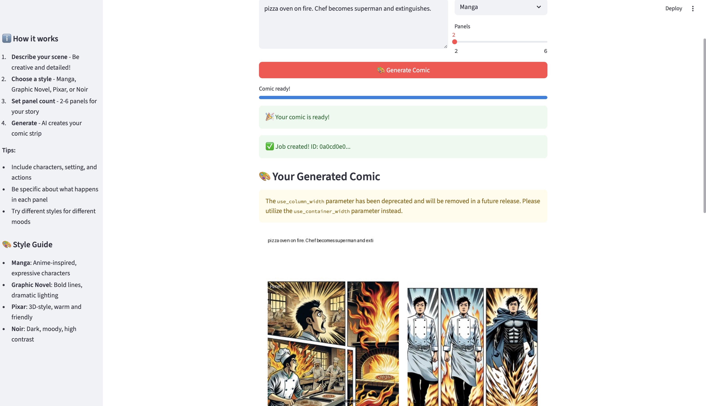

# 🎨 Prompt-to-Comic

**Prompt-to-Comic** is an AI-powered app that turns a creative scene or idea into a visual comic strip. Built with LangGraph, GPT-4o, FastAPI, and DALL·E, the system parses your prompt, breaks it into panels, generates art for each scene, and assembles it into a polished, downloadable comic.

---

## 🚀 Quick Start

```bash
# Clone the repository
git clone https://github.com/yourusername/prompt-to-comic
cd prompt-to-comic

# Set up your OpenAI API key
cp backend/env.example backend/.env
# Edit backend/.env and add your OpenAI API key

# Run with Docker
docker-compose up -d
```

Then visit: **http://localhost:8501** 🎉

---

## 📸 Demo
  
👉 Try it with a prompt like:

> "Two kids in a spaceship arguing about pineapple pizza while a robot watches."

---

## 🧠 How It Works

| Stage | What Happens |
|-------|---------------|
| 🧾 Scene Parsing | Break down prompt into characters, setting, actions |
| 🎞️ Panel Planning | Split the scene into 2–6 visual panels |
| 🖋️ Prompt Generation | Turn each panel into a DALL·E prompt |
| 🧠 AI Image Gen | Generate images via OpenAI API |
| 🖼️ Comic Layout | Arrange into a comic strip and export to PNG |

Built using **LangGraph**, each stage is a reusable, testable node in a directed graph.

---

## ⚙️ Tech Stack

| Layer        | Tech                                |
|--------------|-------------------------------------|
| Backend      | **FastAPI**, LangGraph, OpenAI API |
| Frontend     | **Streamlit**                       |
| Image Models | DALL·E 3                            |
| Layout       | Pillow                              |
| Infra        | Docker, uv                          |

---

## 🔧 Configuration

1. Copy the example environment file:
   ```bash
   cp backend/env.example backend/.env
   ```

2. Edit `backend/.env` and add your OpenAI API key:
   ```env
   OPENAI_API_KEY=sk-your-key-here
   ```

3. Start the services:
   ```bash
   docker-compose up -d
   ```

---

## 🌐 API Endpoints

### `POST /generate`
Generate comic from prompt.
```json
{
  "text": "pirate vs ninja showdown at a sushi bar",
  "style": "Manga",
  "panels": 3
}
```

### `GET /status/{job_id}`
Poll job status and result URL.

### `GET /health`
Returns `{ "status": "ok" }`

### `GET /comics`
List all saved comics.

---

## 📦 Project Structure
```
prompt-to-comic/
├── backend/           # FastAPI backend
│   ├── app/
│   │   ├── main.py
│   │   ├── config.py
│   │   ├── schemas.py
│   │   ├── comic_pipeline.py
│   │   └── utils/
│   ├── Dockerfile
│   └── .env
├── frontend/          # Streamlit frontend
│   ├── app.py
│   ├── api.py
│   └── Dockerfile
├── output/            # Generated comics (gitignored)
├── docker-compose.yml
└── README.md
```

---

## 🐳 Docker Commands

```bash
# Start services
docker-compose up -d

# View logs
docker-compose logs -f

# Stop services
docker-compose down

# Rebuild and start
docker-compose up -d --build

# Check status
docker-compose ps
```

---

## 🛣️ Roadmap
- [ ] Webtoon-style vertical layout
- [ ] Whisper-based voice prompt entry
- [ ] Speech bubble overlays from GPT
- [ ] Comic series creation support
- [ ] User login and gallery

---

## 👨‍💻 Contributing
We love contributors! You can:
- Build new LangGraph nodes
- Add new art styles or models
- Improve layout engine
- Help translate prompts

Please follow our style guide:
- Use `@dataclass` for all schemas
- Format code with `black`
- Write clear node-level docstrings

---

## 📜 License
MIT License

---

## 🙏 Acknowledgements
- [LangGraph](https://github.com/langchain-ai/langgraph)
- [OpenAI](https://openai.com)
- [Streamlit](https://streamlit.io)
- Everyone building creative tools with AI 💛

> Prompt-to-Comic was built to empower storytellers. Whether you're a dreamer, writer, or just messing around — we can't wait to see what you create!
